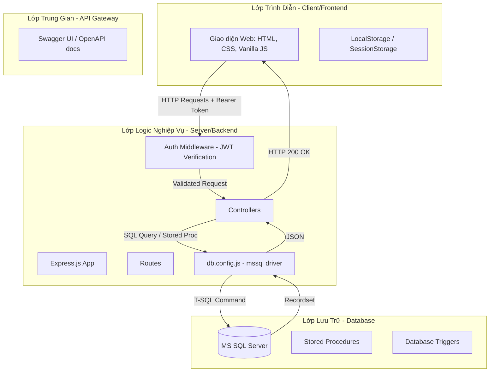
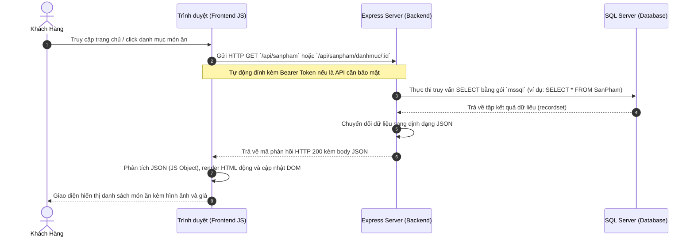
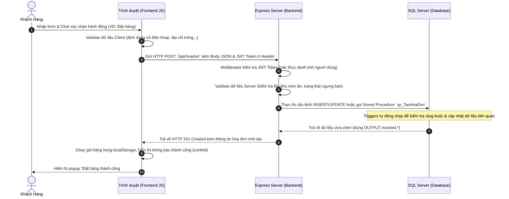

# KIẾN TRÚC VÀ LUỒNG DỮ LIỆU HỆ THỐNG FOODEXPRESS

Tài liệu này cung cấp cái nhìn chi tiết và dễ hiểu về cách hệ thống **FoodExpress** hoạt động, cách dữ liệu di chuyển từ Cơ sở dữ liệu SQL Server lên Backend và Frontend, cũng như chiều ngược lại khi người dùng thực hiện các thao tác trên giao diện.

---

## 1. TỔNG QUAN VỀ KIẾN TRÚC HỆ THỐNG

Hệ thống được xây dựng theo mô hình **3-Tier Architecture (Kiến trúc 3 lớp)** kết hợp với mô hình **MVC/RESTful API**:

---

## 2. LUỒNG DỮ LIỆU ĐI GIỮA CÁC LỚP (DATA FLOW)

### A. Chiều Đọc: Từ SQL Server ➔ Backend ➔ Frontend

Mục đích: Lấy dữ liệu (như danh sách món ăn, thông tin giỏ hàng, lịch sử đơn hàng) từ cơ sở dữ liệu và hiển thị lên trình duyệt cho người dùng.

### B. Chiều Ghi: Từ Frontend ➔ Backend ➔ SQL Server

Mục đích: Gửi thông tin do người dùng nhập hoặc tương tác (như đăng ký, thêm giỏ hàng, đặt hàng, đánh giá) về lưu trữ lâu dài trong database.

---

## 3. CÁCH THỨC HOẠT ĐỘNG CHI TIẾT CỦA CÁC THÀNH PHẦN

### 1. Backend (Node.js & Express.js)
*   **Cấu trúc**: Chia thành các thư mục độc lập để quản lý dễ dàng:
    *   `app.js`: File chạy chính. Khởi tạo server, kết nối Database (`connectDB`), nạp middleware chung (`cors`, `express.json`) và mount các bộ định tuyến (routes).
    *   `config/db.config.js`: Nơi thiết lập cấu hình kết nối (User, Password, Server, Database) bằng thư viện `mssql` để quản lý các Connection Pools.
    *   `routes/`: Định nghĩa các đường dẫn (endpoints) API và gán middleware bảo vệ nếu cần.
    *   `middlewares/auth.middleware.js`: Chứa hàm `verifyToken`. Khi nhận request, nó giải mã header `Authorization: Bearer <Token>`. Nếu hợp lệ, nó gán thông tin giải mã (`NguoiDungID`, `VaiTroID`) vào đối tượng `req.user` và chuyển sang controller; nếu sai hoặc hết hạn (401/403), nó chặn request ngay lập tức.
    *   `controllers/`: Nơi xử lý logic nghiệp vụ chính. Lấy dữ liệu từ `req.body` / `req.params` / `req.query`, thực thi T-SQL với database thông qua các `sql.Request` và trả về kết quả JSON phù hợp.

### 2. Swagger (Tài liệu API tự động)
*   **Công cụ**: Sử dụng thư viện `swagger-jsdoc` và `swagger-ui-express`.
*   **Cấu hình**:
    *   Trong `app.js`, cấu hình thông số OpenAPI 3.0.0, thiết lập máy chủ phát triển và định nghĩa cơ chế bảo mật BearerAuth (JWT Token).
    *   Tại mỗi file route (ví dụ `routes/giohang.routes.js`), các comment đặc biệt dạng YAML nằm ngay trên các định nghĩa route sẽ được `swagger-jsdoc` phân tích để dựng giao diện.
*   **Truy cập**: Khi server khởi chạy trên cổng `3000`, đường dẫn `/api-docs` sẽ hiển thị một trang web trực quan cho phép lập trình viên đọc tham số đầu vào/đầu ra và trực tiếp bấm "Try it out" để kiểm thử API.

### 3. Frontend (HTML, CSS, Vanilla Javascript)
*   **Bảo mật & Trạng thái**: Trình duyệt lưu trữ token (`fe_token`), thông tin người dùng (`fe_user`), giỏ hàng tạm thời (`fe_cart`), và sản phẩm yêu thích (`fe_favorites`) trong `localStorage`.
*   **apiFetch Helper**: Để đơn giản hóa việc gọi API và tự động xử lý bảo mật, frontend định nghĩa hàm `apiFetch(url, options)`:
    *   Tự động đính kèm `Authorization: Bearer <token>` vào request.
    *   Tự động gán header `Content-Type: application/json` nếu body là JS Object.
    *   **Xử lý Token Hết Hạn**: Nếu Backend trả về lỗi 401 hoặc 403, `apiFetch` tự động hiển thị thông báo Toast tiếng Việt, xóa sạch thông tin tài khoản bị lưu lỗi, đóng tất cả modal đang mở và tự động hiển thị Popup đăng nhập cho người dùng.

---

## 4. CHI TIẾT CÁC CHỨC NĂNG CHÍNH (BẢNG, CỘT VÀ CÁCH THỰC HIỆN)

Dưới đây là mô tả chi tiết quy trình xử lý của từng chức năng cốt lõi trong ứng dụng:

### Chức năng 1: Đăng Ký Tài Khoản & Đăng Nhập
#### A. Đăng ký tài khoản (Register)
*   **Luồng hoạt động**: Khách hàng điền thông tin ➔ Frontend gửi POST `/api/register` ➔ Backend băm mật khẩu bằng `bcryptjs` ➔ Chèn dữ liệu vào bảng `NguoiDung`.
*   **Bảng & Thuộc tính cột bị tác động**:
    *   Bảng **`NguoiDung`**:
        *   `VaiTroID`: Được gán mặc định là `2` (Khách hàng).
        *   `HoTen` (NVARCHAR): Họ tên đầy đủ của người dùng.
        *   `TenDangNhap` (VARCHAR): Tên đăng nhập độc nhất (UNIQUE).
        *   `MatKhauHash` (VARCHAR): Mật khẩu đã được mã hóa an toàn 1 chiều.
        *   `Email` (VARCHAR), `SoDienThoai` (VARCHAR), `DiaChi` (NVARCHAR): Thông tin liên hệ.
        *   `NgayTao` (DATETIME): Hệ thống tự động gán thời gian hiện tại (`GETDATE()`).

#### B. Đăng nhập hệ thống (Login)
*   **Luồng hoạt động**: Frontend gửi POST `/api/login` kèm `{ TenDangNhap, MatKhau }` ➔ Backend gọi Stored Procedure `sp_KiemTraDangNhap` ➔ So sánh mật khẩu bằng `bcrypt.compare` ➔ Tạo chuỗi JWT Token chứa payload `{ NguoiDungID, VaiTroID }` gửi về Frontend lưu lại.

---

### Chức năng 2: Quản Lý Giỏ Hàng (Cart Management)
FoodExpress sử dụng mô hình **Hybrid Cart** (Giỏ hàng hỗn hợp). Khi chưa đăng nhập, giỏ hàng lưu ở `localStorage`. Khi người dùng đăng nhập, giỏ hàng được đồng bộ và lưu trữ trực tiếp trong cơ sở dữ liệu để đảm bảo không bị mất khi đổi thiết bị.

#### A. Thêm món ăn vào giỏ (Add to Cart)
*   **Luồng hoạt động**: Người dùng click "Thêm vào giỏ" ➔ Frontend cập nhật giỏ hàng local và gửi POST `/api/giohang/them` ➔ Backend thực hiện kiểm tra:
    1.  Kiểm tra sản phẩm có đang bị tạm ngưng bán hay không (`TrangThai == 0`? ➔ Lỗi).
    2.  Kiểm tra số lượng tồn kho khả dụng (`SoLuongTon`).
    3.  Tìm giỏ hàng hiện tại của người dùng. Nếu chưa có, tự động INSERT một dòng mới vào bảng `GioHang` để lấy `GioHangID`.
    4.  Kiểm tra xem sản phẩm đã có trong `ChiTietGioHang` của giỏ hàng đó chưa:
        *   **Nếu có rồi**: Thực hiện UPDATE cộng dồn số lượng.
        *   **Nếu chưa có**: Thực hiện INSERT mới vào `ChiTietGioHang`.
*   **Bảng & Thuộc tính cột bị tác động**:
    *   Bảng **`GioHang`** (nếu là lần đầu tiên mua hàng):
        *   `NguoiDungID` (INT): Gán khóa ngoại liên kết tới người dùng.
        *   `NgayTao` (DATETIME): Mặc định `GETDATE()`.
    *   Bảng **`ChiTietGioHang`**:
        *   `GioHangID` (INT): Liên kết với giỏ hàng tương ứng.
        *   `SanPhamID` (INT): Liên kết với sản phẩm được thêm.
        *   `SoLuong` (INT): Số lượng khách đặt mua.

#### B. Xóa / Cập nhật số lượng giỏ hàng
*   Khi người dùng bấm nút cộng/trừ số lượng, Frontend gửi PUT `/api/giohang/capnhat` để thay đổi thuộc tính `SoLuong` trong bảng `ChiTietGioHang`. Nếu `SoLuong` truyền lên bằng `0` hoặc nhỏ hơn, Backend tự động xóa dòng đó khỏi bảng.
*   Khi bấm "Xóa", Frontend gửi DELETE `/api/giohang/item/:id` để xóa trực tiếp bản ghi khỏi bảng `ChiTietGioHang`.

---

### Chức năng 3: Đặt Hàng & Thanh Toán (Checkout Flow)
Đây là chức năng phức tạp nhất, sử dụng Stored Procedure `sp_TaoHoaDon` để bao bọc các câu lệnh SQL trong một **TRANSACTION** nhằm đảm bảo tính nhất quán (nếu một bước lỗi, toàn bộ thao tác sẽ được khôi phục - ROLLBACK).

#### A. Quy trình tạo đơn hàng
1.  **Frontend gửi yêu cầu**: Người dùng nhập địa chỉ nhận, số điện thoại, ghi chú và phương thức thanh toán rồi bấm Xác Nhận. Frontend gửi POST `/api/hoadon`.
2.  **Kiểm tra tính hợp lệ trên Backend**:
    *   Quét qua bảng `ChiTietGioHang`, nếu phát hiện sản phẩm có `TrangThai = 0` (đang tạm ngưng bán), ném lỗi và dừng ngay lập tức.
3.  **Thực thi stored procedure `sp_TaoHoaDon`**:
    *   **Bước 3.1: Áp dụng mã khuyến mãi** (nếu có): Tìm thông tin trong bảng `KhuyenMai`. Kiểm tra điều kiện đơn hàng tối thiểu (`DieuKienToiThieu`), ngày áp dụng (`NgayBatDau`, `NgayKetThuc`), và số lượt còn lại (`SoLuong`). Nếu thỏa mãn, trừ đi 1 lượt sử dụng (`SoLuong = SoLuong - 1`).
    *   **Bước 3.2: Tạo hóa đơn**: Chèn thông tin vào bảng `HoaDon`.
    *   **Bước 3.3: Chuyển dữ liệu giỏ hàng sang chi tiết hóa đơn**: Chèn toàn bộ các món từ giỏ hàng hiện tại vào bảng `ChiTietHoaDon`.
    *   **Bước 3.4: Xóa giỏ hàng**: Chạy lệnh `DELETE FROM ChiTietGioHang` để làm trống giỏ hàng của người dùng.
    *   **Bước 3.5: Khởi tạo thông tin thanh toán**: Chèn một bản ghi mới vào bảng `ThanhToan` liên kết với hóa đơn vừa tạo.
4.  **Database Trigger trừ số lượng tồn kho**:
    *   Khi các bản ghi được chèn thành công vào bảng `ChiTietHoaDon`, trigger **`trg_ChiTietHoaDon_Insert`** sẽ tự động kích hoạt. Nó thực hiện câu lệnh cập nhật số lượng tồn kho của các sản phẩm tương ứng:
        `UPDATE SanPham SET SoLuongTon = SoLuongTon - inserted.SoLuong`

#### B. Bảng & Thuộc tính cột bị tác động
*   Bảng **`KhuyenMai`**:
    *   `SoLuong`: Trừ đi 1 (giảm số lượng voucher khả dụng).
*   Bảng **`HoaDon`** (Thêm mới 1 bản ghi):
    *   `NguoiDungID` (INT): ID khách đặt mua.
    *   `KhuyenMaiID` (INT): ID mã voucher đã áp dụng (nếu không có thì để NULL).
    *   `NgayDat` (DATETIME): Mặc định `GETDATE()`.
    *   `TongTien` (DECIMAL): Bằng tổng tiền hàng + phí vận chuyển - số tiền giảm giá.
    *   `TrangThai` (NVARCHAR): Gán mặc định ban đầu là `N'Chờ xác nhận'`.
    *   `DiaChiNhan` (NVARCHAR), `SoDienThoaiNhan` (VARCHAR), `GhiChu` (NVARCHAR): Thông tin giao nhận.
    *   `ViDo` (DECIMAL), `KinhDo` (DECIMAL): Tọa độ địa lý lấy từ bản đồ để vẽ quãng đường giao hàng.
*   Bảng **`ChiTietHoaDon`** (Thêm mới các dòng tương ứng với các món trong giỏ):
    *   `HoaDonID` (INT): Khóa ngoại nối tới hóa đơn vừa chèn.
    *   `SanPhamID` (INT): Khóa ngoại nối tới món ăn.
    *   `SoLuong` (INT): Số lượng đặt mua của món đó.
    *   `DonGia` (DECIMAL): Lưu lại giá bán tại thời điểm mua (để tránh bị ảnh hưởng nếu sau này Admin thay đổi giá bán sản phẩm).
    *   `ThanhTien` (DECIMAL): Cột tự động tính toán (`SoLuong * DonGia`).
*   Bảng **`ThanhToan`** (Thêm mới 1 bản ghi đi kèm hóa đơn):
    *   `HoaDonID` (INT): Khóa ngoại liên kết với hóa đơn vừa tạo.
    *   `PhuongThuc` (NVARCHAR): `'Tiền mặt'`, `'Chuyển khoản'`, hoặc `'Momo'`.
    *   `TrangThaiThanhToan` (NVARCHAR): Mặc định là `N'Chưa thanh toán'`.
    *   `NgayThanhToan` (DATETIME): Ban đầu để `NULL`.

---

### Chức năng 4: Cập Nhật Trạng Thái Đơn Hàng (Order State Management)
Admin hoặc khách hàng gửi yêu cầu PUT tới `/api/hoadon/:id/trangthai` để cập nhật trạng thái đơn hàng. Có hai trường hợp đặc biệt được xử lý tự động:

#### A. Trường hợp 1: Hoàn thành đơn hàng (`TrangThai` ➔ `'Hoàn thành'`)
*   Khi đơn hàng chuyển sang trạng thái `'Hoàn thành'`, Backend sẽ tự động chạy lệnh cập nhật trạng thái thanh toán tương ứng.
*   **Bảng & Thuộc tính cột bị tác động**:
    *   Bảng **`ThanhToan`**:
        *   `TrangThaiThanhToan`: Cập nhật thành `N'Đã thanh toán'`.
        *   `NgayThanhToan`: Cập nhật thành thời điểm hiện tại (`GETDATE()`).

#### B. Trường hợp 2: Hủy đơn hàng (`TrangThai` ➔ `'Đã hủy'`)
*   Khi đơn hàng bị hủy (khách hủy khi đơn đang chờ xác nhận hoặc do admin hủy), hệ thống cần hoàn trả lại các tài nguyên đã chiếm dụng. Việc này được xử lý hoàn toàn tự động thông qua Database Trigger **`trg_HoaDon_UpdateStatus`** sau khi trạng thái hóa đơn đổi sang `'Đã hủy'`:
    1.  **Hoàn tồn kho sản phẩm**: Quét bảng `ChiTietHoaDon` của hóa đơn này và cộng trả lại số lượng tồn kho cho bảng `SanPham`:
        `UPDATE SanPham SET SoLuongTon = SoLuongTon + ChiTietHoaDon.SoLuong`
    2.  **Hoàn lượt sử dụng khuyến mãi** (nếu đơn hàng có áp dụng): Cộng trả lại 1 lượt cho mã voucher trong bảng `KhuyenMai`:
        `UPDATE KhuyenMai SET SoLuong = SoLuong + 1`
*   **Bảng & Thuộc tính cột bị tác động**:
    *   Bảng **`SanPham`**: Cột `SoLuongTon` tăng lên.
    *   Bảng **`KhuyenMai`**: Cột `SoLuong` tăng lên.
    *   Bảng **`HoaDon`**: Cột `TrangThai` cập nhật thành `N'Đã hủy'`.

---

### Chức năng 5: Đánh Giá Món Ăn (Product Review)
*   **Luồng hoạt động**: Khi đơn hàng đã chuyển sang trạng thái `'Hoàn thành'`, nút "Đánh giá món ăn" xuất hiện ở chi tiết đơn hàng. Khách hàng click chọn số sao (1-5) và viết nhận xét ➔ Frontend gửi POST `/api/danhgia` ➔ Backend lưu vào database.
*   **Bảng & Thuộc tính cột bị tác động**:
    *   Bảng **`DanhGia`** (Thêm mới 1 bản ghi):
        *   `SanPhamID` (INT): ID sản phẩm được đánh giá.
        *   `NguoiDungID` (INT): ID của khách hàng viết đánh giá.
        *   `HoaDonID` (INT): ID đơn hàng chứa sản phẩm đó (để đảm bảo khách hàng chỉ đánh giá các sản phẩm mình thực sự đã mua).
        *   `SoSao` (INT): Số sao khách chọn (từ `1` đến `5`).
        *   `BinhLuan` (NVARCHAR): Nội dung đánh giá.
        *   `NgayTao` (DATETIME): Hệ thống tự động gán `GETDATE()`.

---

### Chức năng 6: Yêu Thích Sản Phẩm (Favorites)
*   **Luồng hoạt động**: Người dùng click vào icon trái tim trên thẻ món ăn.
    *   *Thêm vào yêu thích*: Gửi POST `/api/yeuthich` ➔ Thêm bản ghi mới vào bảng `YeuThich`.
    *   *Bỏ yêu thích*: Gửi DELETE `/api/yeuthich/:id` ➔ Xóa bản ghi ra khỏi bảng `YeuThich`.
*   **Bảng & Thuộc tính cột bị tác động**:
    *   Bảng **`YeuThich`**:
        *   `NguoiDungID` (INT): ID người dùng thích sản phẩm.
        *   `SanPhamID` (INT): ID sản phẩm được thích.
        *   `NgayThem` (DATETIME): Thời điểm bấm yêu thích (`GETDATE()`).
        *   *Ràng buộc đặc biệt*: Có khóa phức duy nhất `UNIQUE(NguoiDungID, SanPhamID)` để ngăn việc người dùng thích một sản phẩm nhiều lần gây trùng lặp dữ liệu.
