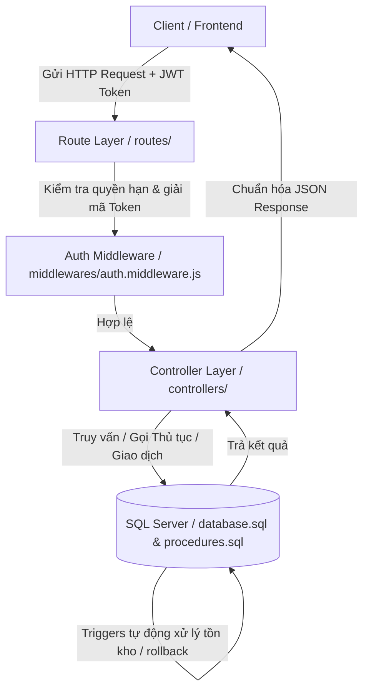
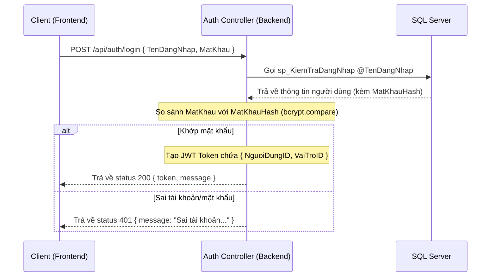
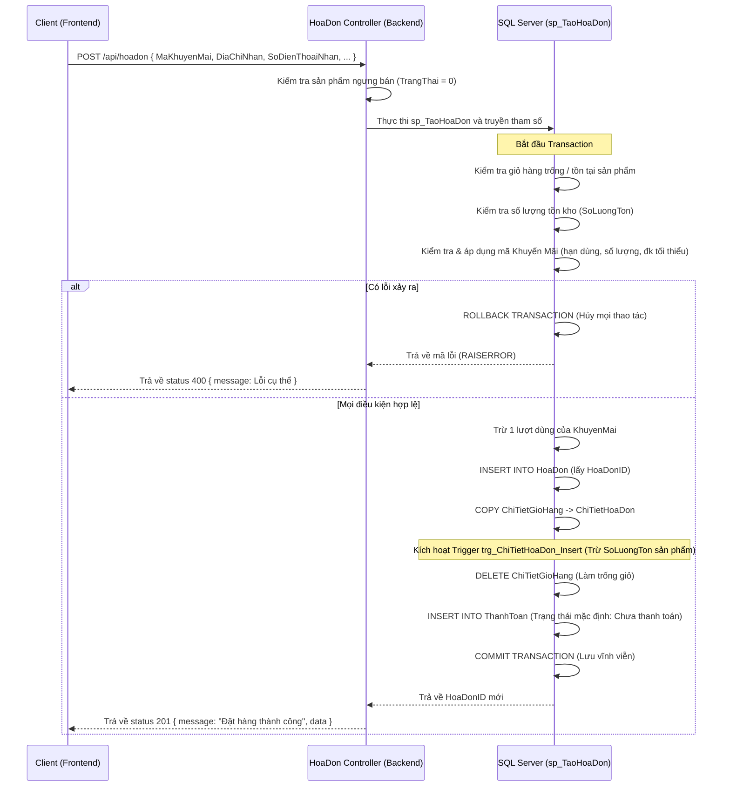
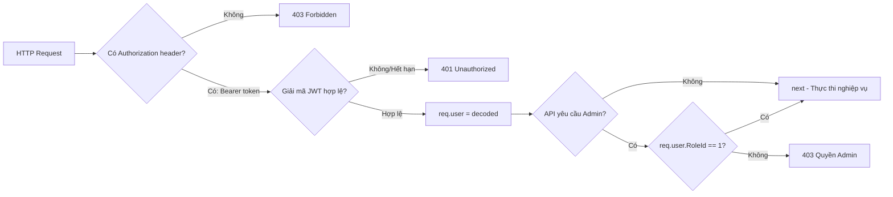

# TÀI LIỆU PHÂN TÍCH CHI TIẾT NGHIỆP VỤ VÀ LUỒNG XỬ LÝ BACKEND FOODEXPRESS

Tài liệu này cung cấp cái nhìn chi tiết và chuyên sâu về cấu trúc mã nguồn, luồng xử lý nghiệp vụ, cách thức hoạt động của API và cơ chế đồng bộ dữ liệu bằng cơ sở dữ liệu ở tầng Backend của hệ thống **FoodExpress**.

---

## I. KIẾN TRÚC HỆ THỐNG VÀ LUỒNG ĐI CỦA REQUEST

Backend của **FoodExpress** được xây dựng trên nền tảng **Node.js** sử dụng framework **Express.js**, kết nối với cơ sở dữ liệu **Microsoft SQL Server** thông qua driver `mssql`. 

Mỗi yêu cầu (Request) từ client sẽ đi qua các lớp xử lý sau:



### Chi tiết các lớp xử lý:
1. **Lớp Định Tuyến (Route Layer)**: Tiếp nhận HTTP request, ánh xạ URL endpoint tới hàm xử lý tương ứng trong Controller.
2. **Lớp Trung Gian (Middleware Layer)**: Thực hiện xác thực người dùng dựa trên JWT Token được gửi kèm trong header `Authorization`. Nếu hợp lệ, gán thông tin định danh vào đối tượng `req.user`.
3. **Lớp Điều Khiển (Controller Layer)**: Nơi chứa logic nghiệp vụ. Lớp này tiếp nhận dữ liệu từ `req.body`, `req.query`, `req.params`, kiểm tra tính hợp lệ nghiệp vụ, giao tiếp với cơ sở dữ liệu và trả về phản hồi chuẩn JSON cho Client.
4. **Lớp Cơ Sở Dữ Liệu (Database Layer)**: Không chỉ lưu trữ dữ liệu tĩnh, mà còn đảm nhận xử lý các nghiệp vụ phức tạp thông qua **Stored Procedures** (Thủ tục lưu trữ), **Transactions** (Giao dịch an toàn), và **Triggers** (Trình kích hoạt tự động).

---

## II. PHÂN TÍCH CHI TIẾT CÁC LUỒNG NGHIỆP VỤ CHÍNH

### 1. Luồng Xác Thực Người Dùng (Authentication Flow)

Xác thực được triển khai bằng cơ chế **JSON Web Token (JWT)**, đảm bảo tính bảo mật và phi trạng thái (stateless) cho hệ thống API.



#### Mã nguồn xử lý chính tại `controllers/auth.controller.js`:
*   **Gọi Stored Procedure**: Hệ thống gọi thủ tục `sp_KiemTraDangNhap` để tìm người dùng một cách an toàn nhằm phòng tránh lỗi SQL Injection:
    ```javascript
    const request = new sql.Request();
    request.input('TenDangNhap', sql.VarChar(50), TenDangNhap);
    const result = await request.execute('sp_KiemTraDangNhap');
    ```
*   **Mã hóa và So Sánh**: Sử dụng thư viện `bcryptjs` để kiểm tra mật khẩu:
    ```javascript
    const isPasswordMatch = await bcrypt.compare(passwordInput, user.MatKhauHash);
    ```
*   **Ký Token**: Sinh JWT Token với khóa bí mật `process.env.JWT_SECRET` hết hạn sau 24 giờ:
    ```javascript
    const token = jwt.sign({ NguoiDungID: user.NguoiDungID, VaiTroID: user.VaiTroID }, process.env.JWT_SECRET, { expiresIn: '24h' });
    ```

---

### 2. Luồng Nghiệp Vụ Giỏ Hàng (Cart Management)

Giỏ hàng là nơi lưu tạm các món ăn trước khi đặt mua. Nó được lưu trữ trực tiếp dưới cơ sở dữ liệu (`GioHang` và `ChiTietGioHang`) để khách hàng không bị mất giỏ hàng khi đổi thiết bị hoặc tải lại trang.

#### A. Lấy thông tin giỏ hàng (`GET /api/giohang/:nguoidungid`)
*   **Cơ chế tự động khởi tạo**: Khi lấy giỏ hàng, nếu người dùng mới chưa từng có giỏ hàng, Backend sẽ tự động tạo một giỏ hàng trống trong CSDL trước khi trả về kết quả:
    ```javascript
    let cartResult = await request.query('SELECT GioHangID FROM GioHang WHERE NguoiDungID = @NguoiDungID');
    if (cartResult.recordset.length === 0) {
      const createCartResult = await request.query('INSERT INTO GioHang (NguoiDungID) OUTPUT inserted.GioHangID VALUES (@NguoiDungID)');
      gioHangId = createCartResult.recordset[0].GioHangID;
    }
    ```
*   **Tính tổng tiền**: Backend thực hiện phép tính tổng tiền giỏ hàng bằng hàm `reduce` trên mảng kết quả lấy từ database trước khi trả về cho Client.

#### B. Thêm sản phẩm vào giỏ hàng (`POST /api/giohang/them`)
*   **Kiểm tra trạng thái bán**: Đảm bảo món ăn đó đang được bán (`TrangThai = 1`). Nếu `TrangThai = 0`, trả về lỗi không cho phép thêm.
*   **Kiểm tra tồn kho**:
    *   Nếu món ăn **đã có** trong giỏ: Tính tổng số lượng mới (`SoLuongHienCo + SoLuongMuonThem`). Nếu tổng này vượt quá `SoLuongTon` của cửa hàng, Backend chặn lại và báo lỗi.
    *   Nếu món ăn **chưa có** trong giỏ: So sánh số lượng muốn thêm với `SoLuongTon`.
*   **Cập nhật hoặc Thêm mới**: Sử dụng câu lệnh `UPDATE` tăng số lượng nếu đã tồn tại, ngược lại sử dụng `INSERT INTO ChiTietGioHang`.

#### C. Thay đổi số lượng món ăn trong giỏ (`PUT /api/giohang/capnhat`)
*   **Cơ chế tự động xóa**: Khi người dùng giảm số lượng món ăn về $0$ hoặc nhỏ hơn, Backend tự động xóa món ăn đó ra khỏi giỏ hàng:
    ```javascript
    if (qty <= 0) {
      await deleteReq.query('DELETE FROM ChiTietGioHang WHERE ChiTietGioHangID = @ChiTietGioHangID');
    }
    ```
*   **Ràng buộc tồn kho**: Nếu cập nhật số lượng lớn hơn, hệ thống kiểm tra tồn kho tương tự như lúc thêm mới.

---

### 3. Luồng Nghiệp Vụ Thanh Toán & Tạo Hóa Đơn (Checkout & Order Flow)

Đây là luồng nghiệp vụ cốt lõi và phức tạp nhất, đòi hỏi tính nhất quán dữ liệu cao để tránh tình trạng lỗi bất đồng bộ (ví dụ: tạo được đơn hàng nhưng không trừ được kho hoặc không áp dụng được voucher). Do đó, luồng này sử dụng **Stored Procedure `sp_TaoHoaDon`** kết hợp **SQL Transaction**.



#### Giải thích chi tiết các bước xử lý trong Thủ tục `sp_TaoHoaDon` (`procedures.sql`):

1.  **Kiểm tra điều kiện tiên quyết**:
    *   Kiểm tra giỏ hàng có rỗng không.
    *   Kiểm tra xem sản phẩm có bị khóa (`TrangThai = 0`) hoặc số lượng mua vượt quá hàng tồn kho hay không.
2.  **Áp dụng Khuyến Mãi**:
    *   Tìm kiếm `MaKhuyenMai` trong hệ thống.
    *   Kiểm tra tính hợp lệ của mã:
        *   Tổng tiền đơn hàng có đạt giá trị tối thiểu không (`TongTienGoc >= DieuKienToiThieu`).
        *   Thời gian hiện tại có nằm trong khoảng hiệu lực của mã giảm giá không (`GETDATE() BETWEEN NgayBatDau AND NgayKetThuc`).
        *   Mã giảm giá còn lượt sử dụng không (`SoLuong > 0`).
        *   Mã giảm giá có đang ở trạng thái hoạt động không (`TrangThai = 1`).
    *   Nếu không thỏa mãn bất kỳ điều kiện nào, gán mã lỗi âm tương ứng (`-1` đến `-4`) để ném lỗi bằng `RAISERROR`.
3.  **Xử lý trong Transaction**:
    *   `BEGIN TRY ... BEGIN TRANSACTION`: Mở đầu khối giao dịch an toàn.
    *   `UPDATE KhuyenMai`: Giảm số lượng mã khuyến mãi đi 1 lượt.
    *   `INSERT INTO HoaDon`: Tạo đơn hàng và lưu các thông tin bao gồm cả Tọa độ địa lý giao hàng (`ViDo`, `KinhDo`). Sử dụng `SCOPE_IDENTITY()` để lấy ID hóa đơn vừa chèn.
    *   `INSERT INTO ChiTietHoaDon`: Đổ toàn bộ sản phẩm đang có từ giỏ hàng sang chi tiết hóa đơn với đơn giá tại thời điểm mua.
    *   `DELETE FROM ChiTietGioHang`: Làm sạch giỏ hàng của người dùng.
    *   `INSERT INTO ThanhToan`: Khởi tạo thông tin thanh toán mặc định gắn liền với hóa đơn (Trạng thái mặc định: `'Chưa thanh toán'`).
    *   `COMMIT TRANSACTION`: Nếu chạy hết các lệnh mà không phát sinh lỗi, lưu vĩnh viễn dữ liệu xuống đĩa cứng.
    *   `ROLLBACK TRANSACTION`: Nếu gặp lỗi ở bất kỳ bước nào (ví dụ: mất kết nối, lỗi phần cứng hoặc vi phạm ràng buộc dữ liệu), khối `CATCH` sẽ hoàn trả toàn bộ dữ liệu về trạng thái ban đầu như chưa có chuyện gì xảy ra.

---

### 4. Cơ Chế Trigger Tự Động Trong Cơ Sở Dữ Liệu

Để giảm tải việc tính toán cho Node.js server và tránh xung đột dữ liệu khi có nhiều người mua hàng đồng thời (concurrency), hệ thống sử dụng các Trình kích hoạt (Triggers) chạy trực tiếp trong SQL Server:

#### A. Trigger Trừ Kho Khi Đặt Hàng (`trg_ChiTietHoaDon_Insert`)
Được kích hoạt tự động **sau khi** chèn bản ghi vào bảng `ChiTietHoaDon`. Trigger này sẽ trừ đi số lượng tồn kho tương ứng của sản phẩm:
```sql
CREATE TRIGGER trg_ChiTietHoaDon_Insert
ON ChiTietHoaDon
AFTER INSERT
AS
BEGIN
    SET NOCOUNT ON;
    UPDATE sp
    SET sp.SoLuongTon = sp.SoLuongTon - i.SoLuong
    FROM SanPham sp
    INNER JOIN inserted i ON sp.SanPhamID = i.SanPhamID;
END;
```

#### B. Trigger Hoàn Kho & Voucher Khi Hủy Đơn (`trg_HoaDon_UpdateStatus`)
Được kích hoạt tự động **sau khi** cập nhật cột `TrangThai` trong bảng `HoaDon`. Khi trạng thái đơn hàng được cập nhật thành `'Đã hủy'` từ một trạng thái khác, trigger này sẽ tự động:
1.  **Cộng trả lại số lượng tồn kho** cho các món ăn đã đặt trong đơn hàng bị hủy:
    ```sql
    UPDATE sp
    SET sp.SoLuongTon = sp.SoLuongTon + cthd.SoLuong
    FROM SanPham sp
    INNER JOIN ChiTietHoaDon cthd ON sp.SanPhamID = cthd.SanPhamID
    INNER JOIN inserted i ON cthd.HoaDonID = i.HoaDonID
    INNER JOIN deleted d ON i.HoaDonID = d.HoaDonID
    WHERE i.TrangThai = N'Đã hủy' AND d.TrangThai <> N'Đã hủy';
    ```
2.  **Cộng trả lại 1 lượt sử dụng cho mã khuyến mãi** nếu hóa đơn bị hủy đó có áp dụng khuyến mãi:
    ```sql
    UPDATE km
    SET km.SoLuong = km.SoLuong + 1
    FROM KhuyenMai km
    INNER JOIN inserted i ON km.KhuyenMaiID = i.KhuyenMaiID
    INNER JOIN deleted d ON i.HoaDonID = d.HoaDonID
    WHERE i.TrangThai = N'Đã hủy' AND d.TrangThai <> N'Đã hủy' AND i.KhuyenMaiID IS NOT NULL;
    ```

---

### 5. Luồng Cập Nhật Trạng thái Đơn Hàng & Thanh Toán

Mối quan hệ giữa trạng thái đơn hàng (`TrangThai` của `HoaDon`) và trạng thái thanh toán (`TrangThaiThanhToan` của `ThanhToan`) được đồng bộ chặt chẽ thông qua hàm `updateTrangThai` tại `controllers/hoadon.controller.js`:

*   **Phân quyền chặt chẽ**:
    *   **Admin**: Có toàn quyền chuyển đơn hàng sang các trạng thái `Chờ xác nhận`, `Đang giao`, `Hoàn thành`, `Đã hủy`.
    *   **Khách hàng**: Chỉ được phép hủy đơn hàng (`Đã hủy`) khi đơn hàng đang ở trạng thái `Chờ xác nhận` hoặc `Đang giao` (phòng trường hợp shipper giao hàng đến nhưng khách trả hàng hoặc hủy đột xuất). Ngoài ra, Khách hàng có thể tự xác nhận đơn đã hoàn thành (`Hoàn thành`) sau khi nhận hàng.
*   **Đồng bộ trạng thái thanh toán**: Khi đơn hàng được xác nhận là `Hoàn thành`, Backend sẽ tự động cập nhật trạng thái thanh toán tương ứng sang `Đã thanh toán` và ghi nhận thời điểm thanh toán:
    ```javascript
    if (TrangThai === 'Hoàn thành') {
      const payRequest = new sql.Request();
      payRequest.input('HoaDonID', sql.Int, id);
      await payRequest.query(`
        UPDATE ThanhToan
        SET TrangThaiThanhToan = N'Đã thanh toán', NgayThanhToan = GETDATE()
        WHERE HoaDonID = @HoaDonID
      `);
    }
    ```

---

## III. CƠ CHẾ BẢO MẬT & PHÂN QUYỀN TRÊN ENDPOINTS

Tất cả các API yêu cầu đăng nhập đều được bảo vệ bởi middleware `verifyToken` (`middlewares/auth.middleware.js`).



### 1. Giải mã token và xác minh danh tính
Middleware `verifyToken` thực hiện tách token từ chuỗi `Bearer <token>` ở Header `Authorization`, giải mã payload để lấy thông tin định danh:
```javascript
const decoded = jwt.verify(token, process.env.JWT_SECRET);
req.user = decoded; // Gán thông tin người dùng vào đối tượng request để sử dụng ở Controller
```

### 2. Kiểm soát truy cập của Admin (RBAC)
Với các API quản lý như thêm/sửa/xóa sản phẩm, danh mục, cấu hình khuyến mãi, hệ thống tích hợp thêm middleware `isAdmin`:
```javascript
const isAdmin = (req, res, next) => {
  if (!req.user || req.user.RoleId !== 1) { // 1 là mã vai trò của Admin
    return res.status(403).json({ message: 'Yêu cầu quyền Quản trị viên' });
  }
  next();
};
```

---

## IV. TỔNG HỢP CÁC ENDPOINTS CHÍNH CỦA BACKEND

Hệ thống cung cấp bộ tài liệu API tự động tích hợp qua **Swagger UI** tại đường dẫn `/api-docs`. Dưới đây là danh sách phân loại các API chính:

| Nhóm chức năng | Endpoint | Phương thức | Xác thực | Phân quyền | Mô tả |
| :--- | :--- | :---: | :---: | :---: | :--- |
| **Xác thực** | `/api/auth/login` | `POST` | Không | Tất cả | Đăng nhập hệ thống, sinh JWT Token |
| **Sản phẩm** | `/api/sanpham` | `GET` | Không | Tất cả | Lấy danh sách sản phẩm (có phân trang) |
| | `/api/sanpham/:id` | `GET` | Không | Tất cả | Lấy chi tiết món ăn kèm số sao trung bình |
| | `/api/sanpham/timkiem` | `GET` | Không | Tất cả | Tìm kiếm món ăn theo tên hoặc mô tả |
| | `/api/sanpham` | `POST` | Có | Admin | Tạo mới món ăn |
| | `/api/sanpham/:id` | `PUT` | Có | Admin | Cập nhật món ăn |
| | `/api/sanpham/:id` | `DELETE` | Có | Admin | Xóa món ăn khỏi hệ thống |
| **Giỏ hàng** | `/api/giohang/:nguoidungid`| `GET` | Có | Khách hàng | Lấy giỏ hàng hiện tại (hoặc tự động tạo mới) |
| | `/api/giohang/them` | `POST` | Có | Khách hàng | Thêm món ăn vào giỏ (kiểm tra tồn kho) |
| | `/api/giohang/capnhat` | `PUT` | Có | Khách hàng | Tăng/giảm số lượng (xóa nếu số lượng $\le 0$) |
| | `/api/giohang/item/:id` | `DELETE` | Có | Khách hàng | Xóa sản phẩm khỏi giỏ hàng |
| **Đơn hàng** | `/api/hoadon` | `POST` | Có | Khách hàng | Tạo hóa đơn mới từ giỏ hàng (áp dụng Transaction) |
| | `/api/hoadon` | `GET` | Có | Chủ đơn/Admin | Xem lịch sử đơn hàng |
| | `/api/hoadon/:id` | `GET` | Có | Chủ đơn/Admin | Xem chi tiết đơn hàng, sản phẩm đã mua |
| | `/api/hoadon/:id/trangthai`| `PUT` | Có | Chủ đơn/Admin | Cập nhật trạng thái đơn (đồng bộ thanh toán) |
| **Khuyến mãi**| `/api/khuyenmai/ap-dung` | `POST` | Có | Khách hàng | Kiểm tra điều kiện và tính số tiền giảm giá |
| | `/api/khuyenmai` | `POST` | Có | Admin | Thêm mã giảm giá mới |

---

## V. ĐÁNH GIÁ CHUNG VỀ THIẾT KẾ BACKEND

*   **Điểm mạnh**:
    *   **Tính toàn vẹn dữ liệu cao**: Nhờ áp dụng Transaction trong Stored Procedure ở những nghiệp vụ quan trọng như Đặt hàng giúp đảm bảo CSDL không bao giờ rơi vào trạng thái không nhất quán.
    *   **Hiệu năng xử lý tối ưu**: Di chuyển các thao tác tính toán số lượng tồn kho và hoàn trả lượt voucher xuống tầng CSDL bằng Triggers, giảm thiểu số lượng truy vấn mạng giữa Server ứng dụng và Server database.
    *   **Thiết kế API chuẩn RESTful**: Phân tách rõ ràng giữa Routes và Controllers, đi kèm tài liệu Swagger dễ kiểm thử.
    *   **Bảo mật phân quyền rõ ràng**: Phân biệt rạch ròi quyền hạn giữa Khách hàng và Admin bằng JWT và middleware.
